# Carrom Arena

A graphical, cross-platform, four-robot autonomous Carrom simulation. Four AI players play complete matches under International Carrom Federation rules — no human gameplay input required. Watch, pause, change speed, restart.

## Download

**[Latest release ⬇](https://github.com/tuklusan/carrom-arena/releases/latest)**

Grab the zip for your platform, unzip, and run — everything (assets, sound effects) is embedded in the single executable. No installation, no dependencies.

## Controls

| Key | Action |
|-----|--------|
| **Space** | Pause / resume |
| **+ / -** | Speed up / slow down |
| **R** | Restart with a new seed |
| **M** | Mute |
| **Q / Esc** | Quit |

## Screenshots

Every release is built and run on all of the platforms below, as proof it actually works there — not just that it compiles.

### Linux

<table>
<tr>
<td align="center">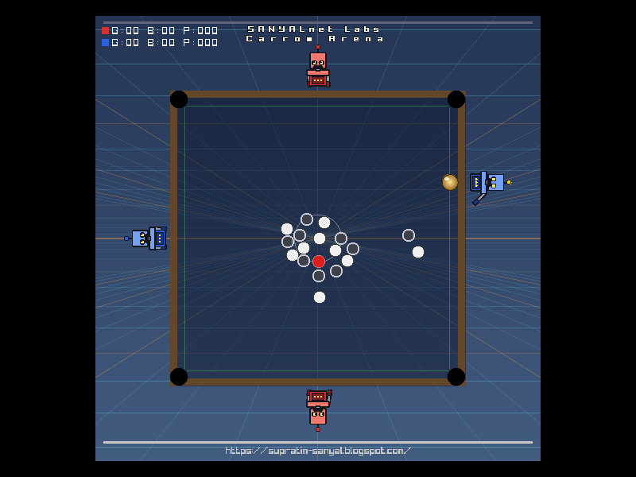 Ubuntu 24.04 · x64</td>
<td align="center">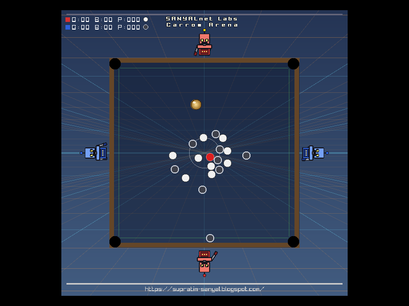 Ubuntu 24.04 · ARM64</td>
<td align="center">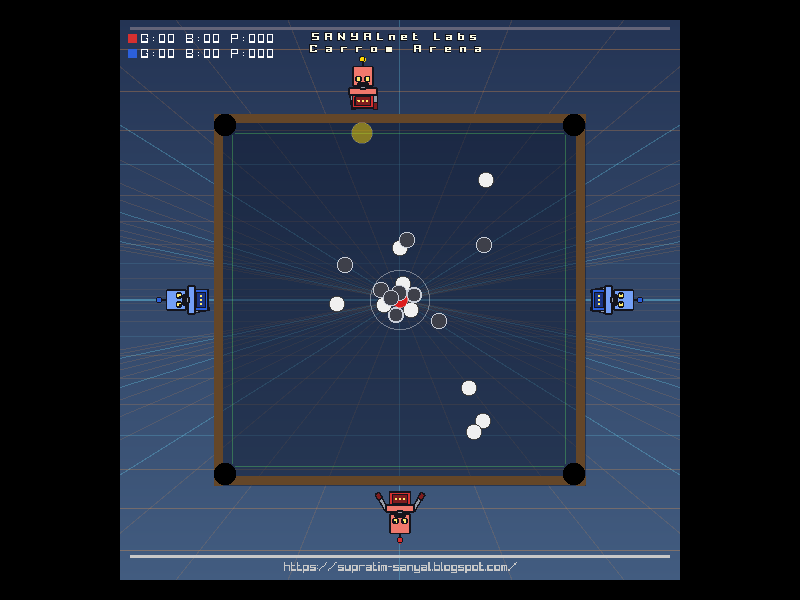 Ubuntu 22.04 · x64</td>
</tr>
<tr>
<td align="center">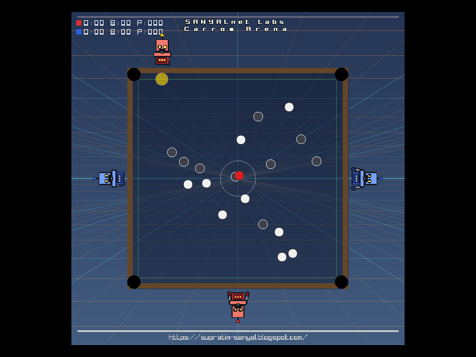 Ubuntu 22.04 · ARM64</td>
<td align="center">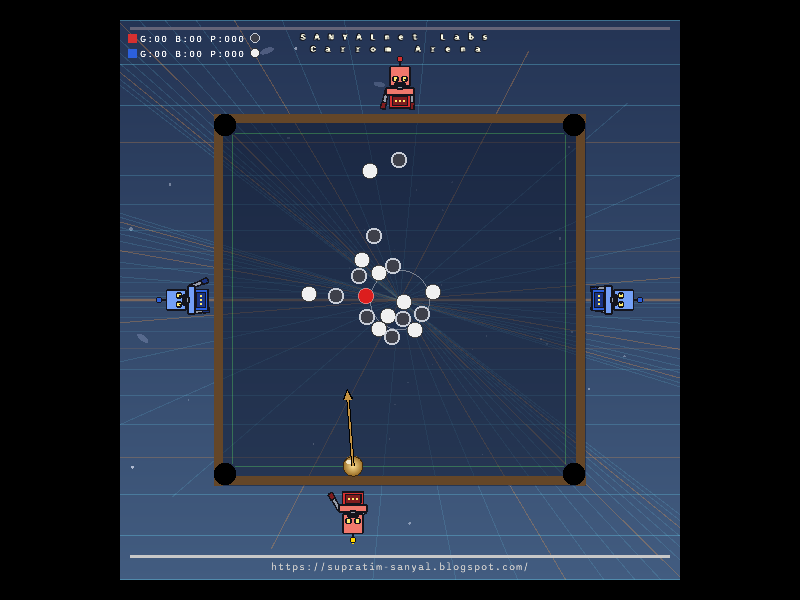 Ubuntu 26.04 · x64</td>
<td align="center">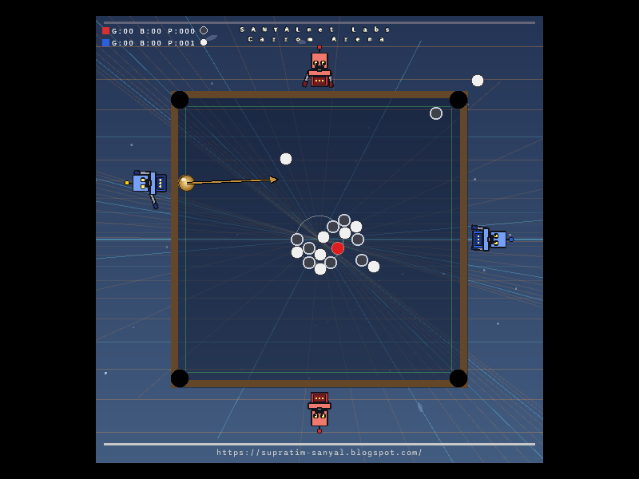 Ubuntu 26.04 · ARM64</td>
</tr>
<tr>
<td align="center">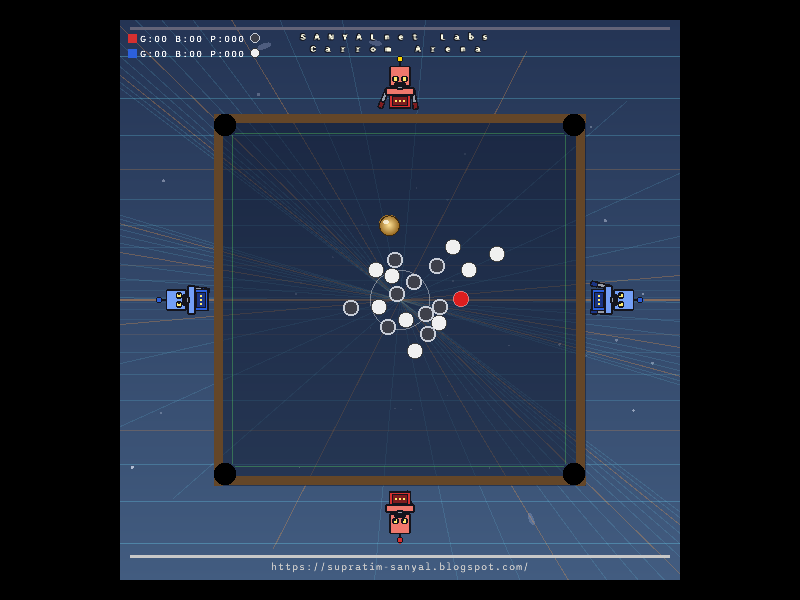 Ubuntu Slim · x64</td>
<td></td>
<td></td>
</tr>
</table>

### Windows

<table>
<tr>
<td align="center">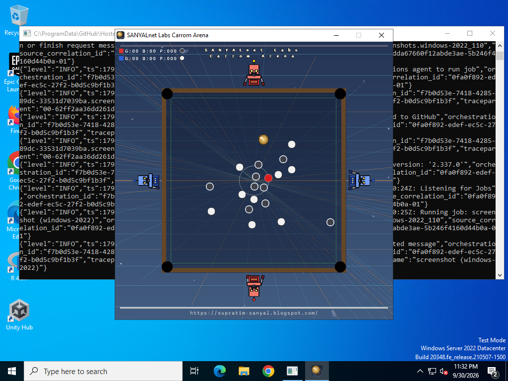 Windows Server 2022 · x64</td>
<td align="center">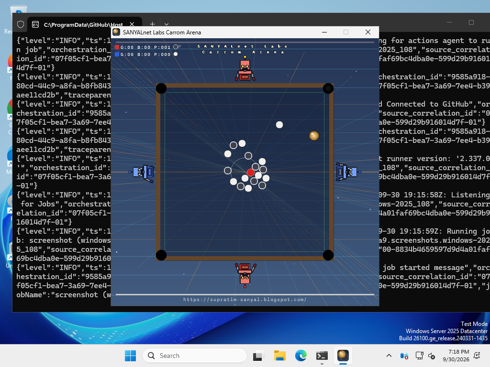 Windows Server 2025 · x64</td>
<td align="center">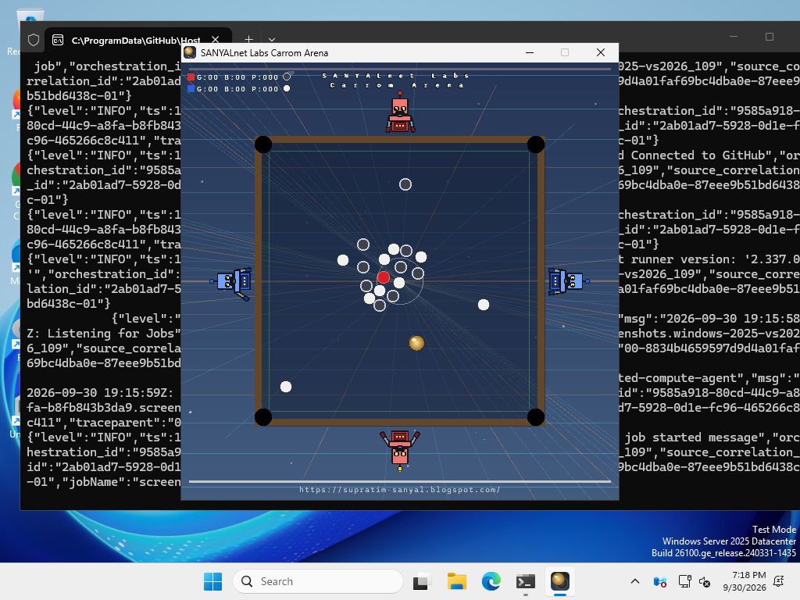 Windows Server 2025 (VS2026) · x64</td>
</tr>
</table>

### macOS

<table>
<tr>
<td align="center">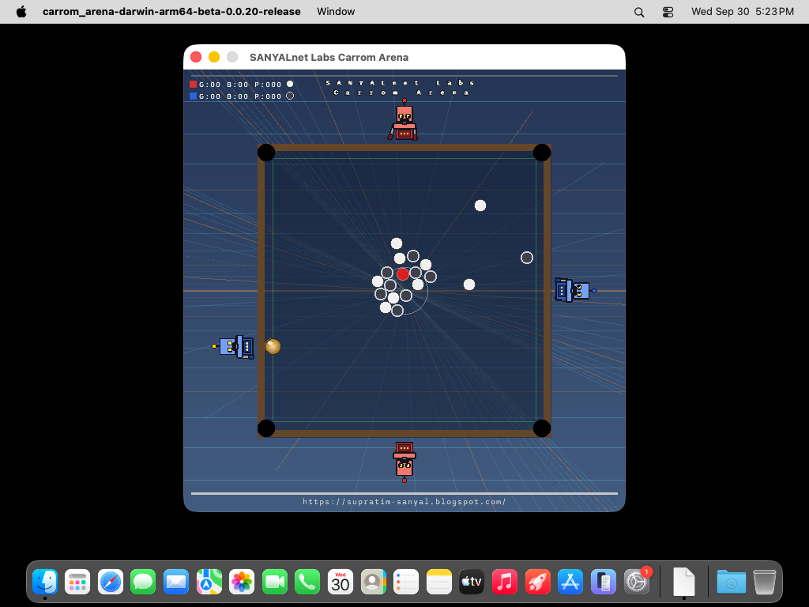 macOS 26 Tahoe · Apple Silicon</td>
<td align="center">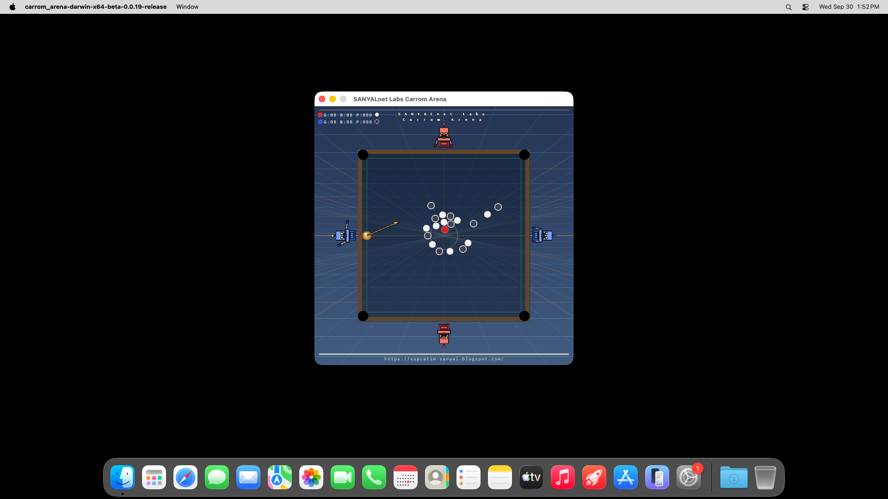 macOS 26 Tahoe · Intel</td>
<td align="center">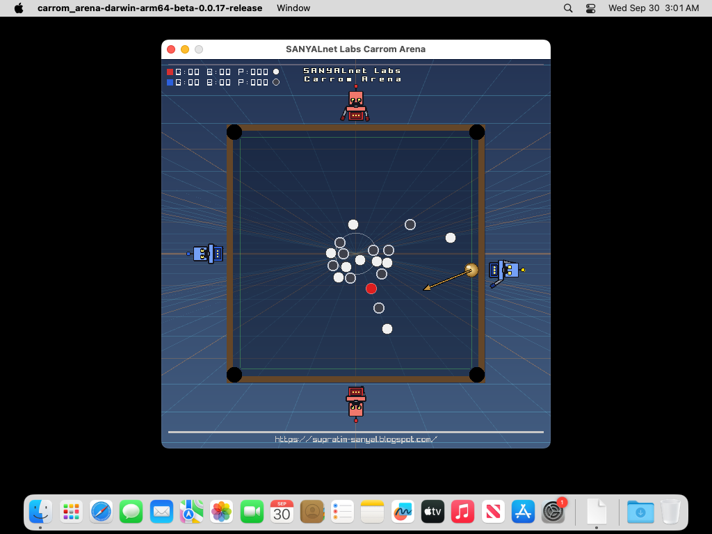 macOS 15 Sequoia · Apple Silicon</td>
</tr>
<tr>
<td align="center">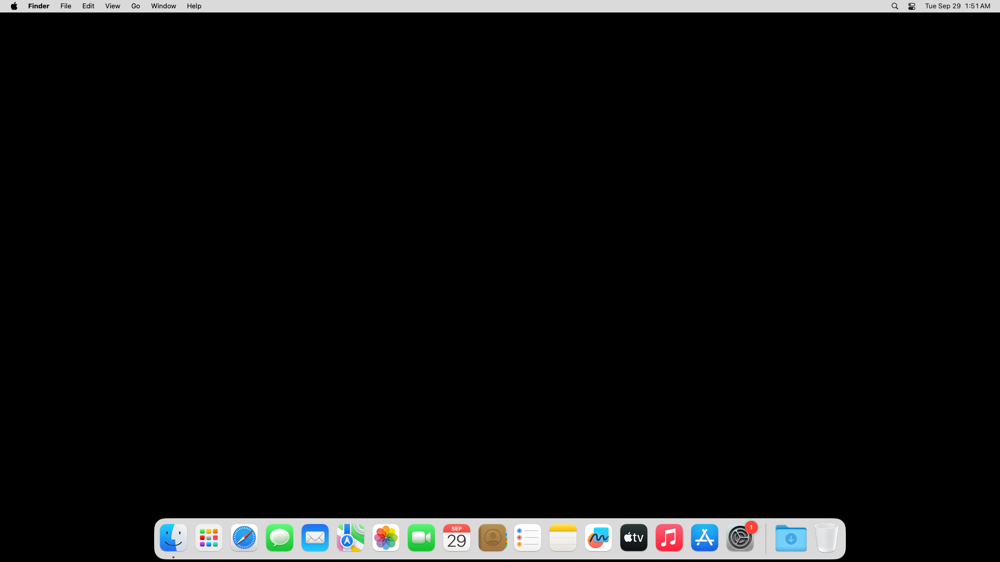 macOS 15 Sequoia · Intel</td>
<td align="center">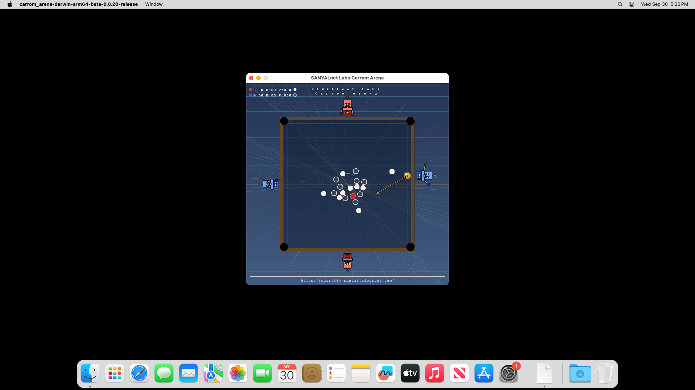 macOS 14 Sonoma · Apple Silicon</td>
<td align="center">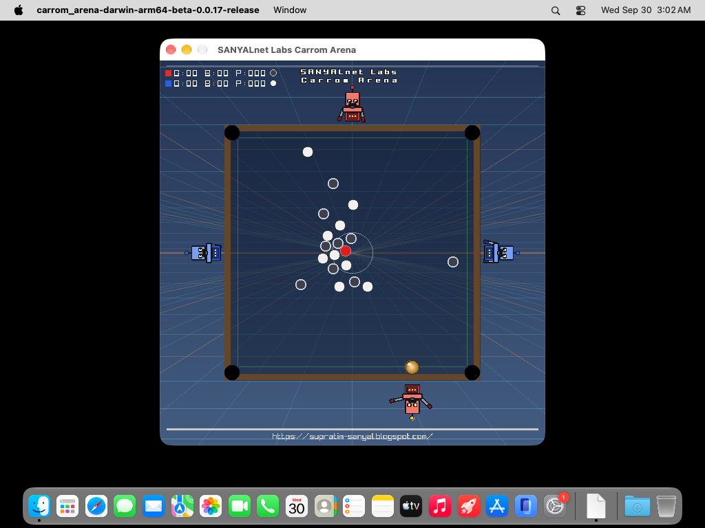 Xcode 27 (preview) · Apple Silicon</td>
</tr>
</table>

## License

Carrom Arena is released under the **SANYALnet Labs Non-Commercial License** (see [`LICENSE`](LICENSE)): free use, modification and distribution for non-commercial purposes only, with attribution — *Based on original work by Supratim Sanyal of SANYALnet Labs.*

Third-party material keeps its own license: raylib 5.5 (zlib/libpng), Box2D v3.1.0 (MIT), Unity Test Framework (MIT), sound effects from Kenney (CC0, see [`assets/audio/CREDITS.md`](assets/audio/CREDITS.md)). The in-game radio streams the public [AH.FM](https://ah.fm) internet radio and bundles no recording.
